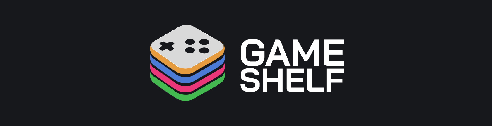

# Game Shelf

**GameShelf** connects you to your Steam library. Organize, rate, and discover games with a social experience **made by gamers, for gamers**.

## ⬜ Topics

- [About project](#1)
- [Functions](#2)
- [Technologies used](#3)
- [Architecture](#6)
- [License](LICENSE)
- [Developers](#7)

---

## ⬜ About project

**GameShelf** is a Brazilian startup dedicated to transforming the way players manage their digital libraries. Our mobile app connects directly to Steam, offering a **modern, social, and intuitive experience** for organizing games. Through automatic synchronization, reviews, personalized lists, and a design crafted for gamers, GameShelf helps each user rediscover their favorite titles and plan what to play next. More than just an app, we are a community that values the joy of gaming with purpose and style.

## ⬜ Functions

🚧 **in production**

## ⬜ Technologies used

- Linguagem: **Kotlin**
- IDE: **Android Studio**
- Framework: **Jetpack Compose**

## ⬜ Architecture

🚧 **in production**

## ⬜ Developers

<table align="center">
  <tr>
    <td align="center">
      <a href="https://github.com/Glauedson">
        
         
        <b>Glauedson Carlos</b>
      </a>
       
      💻 Developer
    </td>
    <td align="center">
      <a href="https://github.com/GustavoDeltta">
        
         
        <b>Gustavo Silva</b>
      </a>
       
      💻 Developer
    </td>
  </tr>
</table>